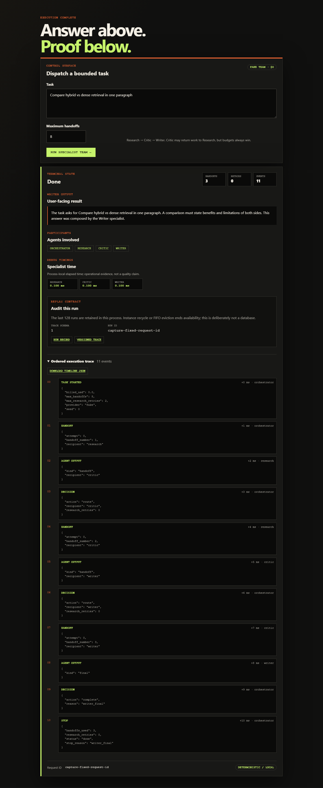
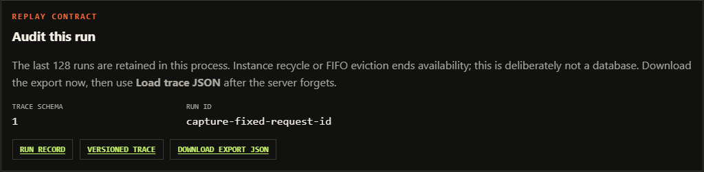

# Multi-Agent Orchestration

<p align="center">
  <a href="https://github.com/pabloalvarez99/production-rag"></a>
  <a href="https://github.com/pabloalvarez99/agentic-rag-research"></a>
  <a href="https://github.com/pabloalvarez99/multi-agent-orchestration"></a>
  <a href="https://github.com/pabloalvarez99/repomind"></a>
  <a href="https://github.com/pabloalvarez99/ai-platform"></a>
</p>

[](https://github.com/pabloalvarez99/multi-agent-orchestration/actions/workflows/ci.yml)

Project 3 in a five-system [AI Engineering portfolio](https://github.com/pabloalvarez99):
deterministic Research, Critic, and Writer specialists coordinated under explicit handoff and
retry budgets, with Writer-only final output and typed degraded outcomes.

> **v0.2.0 LIVE.** The fake team remains the default for the
> library, API, CLI, browser console, and 18-case offline scorecard. Research can optionally cross the
> public P2 HTTP boundary when `AGENTIC_RAG_URL` is explicitly configured. No model key is
> required and the default path makes no network call.

**Hosted free path:** [pax-orchestration.vercel.app](https://pax-orchestration.vercel.app)
opens the same fake-specialist console with no account, API key, or paid model. The hosted
demo has serverless cold starts and process-local metrics/trace retention: both reset whenever
Vercel recycles an instance.

The [architecture](docs/architecture.md) and four accepted ADRs make the intended
authority, Writer-only final rule, budgets, and degraded mode implemented through M2, plus
the M3 timeline and M4 evaluation boundary.
[SHIP.md](docs/SHIP.md) remains the shorter source of truth for what is runnable.
The [case study](docs/CASESTUDY.md) is the one-page engineering story behind the policy
trade-offs.

## See the orchestration



*Deterministic fake specialists. Not a quality claim.* The capture shows the actual local UI:
three handoffs, Writer-owned final output, 11 ordered events, and a normalized display-only
request ID. Runtime request IDs remain unique.

The bounded failure path and longer Critic retry timeline are preserved in
[SHIP](docs/SHIP.md#generated-ui-evidence). Regenerate every committed PNG and its SHA-256
manifest with:

```bash
pip install -e ".[docs]"
playwright install chromium
python scripts/capture_ui.py
```



Each API/UI task is addressable during its process lifetime through
`GET /v1/runs/{id}` and `GET /v1/runs/{id}/trace`. Trace schema 1 uses logical
`ts_offset_ms` values so same task + seed produces an exactly comparable event sequence; see
[ADR-0005](docs/adr/0005-versioned-process-local-traces.md). This is a bounded 128-run FIFO,
not durable storage.

## Run the free path

No API key or hosted provider is used.

Try it immediately at <https://pax-orchestration.vercel.app>, or run the identical path
locally:

```bash
python -m venv .venv
# Windows: .venv\Scripts\activate
# macOS/Linux: source .venv/bin/activate
pip install -e ".[dev]"
uvicorn mao.main:app --reload
```

Open [http://127.0.0.1:8000/](http://127.0.0.1:8000/) for the accessible task console. It
shows terminal status, Writer output, participants, handoff/retry accounting, request ID, and
the ordered trace.

```bash
curl http://127.0.0.1:8000/health
# {"status":"ok"}

curl -s -X POST http://127.0.0.1:8000/v1/tasks \
  -H "content-type: application/json" \
  -d '{"task":"Audit retrieval risk","budget":{"max_handoffs":8}}'
```

Run the actual free orchestration path as a library:

```python
from mao.orchestrator import run_task

result = run_task("Audit retrieval risk")
print(result.model_dump_json(indent=2))
# status=done, one bounded Critic -> Research retry, Writer-authored result
```

The CLI and offline scorecard use the same path:

```bash
python -m mao.task --task "Compare hybrid vs dense retrieval"
python -m mao.evals.run --pretty
```

## Optional P2 Research

The remote specialist is opt-in. An empty setting never changes the fake default:

```bash
export AGENTIC_RAG_URL="http://127.0.0.1:8001"
curl -s -X POST http://127.0.0.1:8000/v1/tasks \
  -H "content-type: application/json" \
  -d '{"task":"Compare hybrid and dense retrieval","research":"http"}'
```

P3 sends one bounded `POST /v1/research` with P2's fake retriever by default. Missing
configuration is a typed `409 capability_missing`; timeout, transport, HTTP, or response
contract failures terminate as `degraded`. The P2 trace is not copied into the final result.

## Docker

```bash
docker compose up --build
# UI: http://127.0.0.1:8000/  API: http://127.0.0.1:8000/docs
```

The image uses Python 3.12 slim and runs Uvicorn as an unprivileged user. This compose file
operates P3 alone; it is not the portfolio-wide P5 topology.

## Verify

```bash
ruff check .
mypy src/mao
pytest -q
python -m mao.evals.run
```

## LIVE surface

| Capability | State |
| --- | --- |
| Fake Research → Critic → Writer workflow, budgets, Writer-only final | **LIVE** |
| JSON API, CLI, accessible UI, request IDs, ordered trace | **LIVE** |
| Versioned trace replay + bounded last-128 run lookup | **LIVE (process-local)** |
| Optional P2 HTTP Research, fail-closed to `degraded` | **LIVE (opt-in)** |
| 12 routing goldens + 2 boundary + 4 chaos cases, billed `$0` | **LIVE** |
| Ruff + mypy + pytest + evals in empty-key CI | **LIVE** |
| Non-root Docker image and standalone Compose | **LIVE** |
| Hosted credential-free console and API | **LIVE** — [`pax-orchestration.vercel.app`](https://pax-orchestration.vercel.app) |
| Hosted models, remote-process isolation, multi-agent quality uplift | **PLANNED / not claimed** |
| Public [`v0.2.0`](https://github.com/pabloalvarez99/multi-agent-orchestration/releases/tag/v0.2.0) GitHub release | **LIVE** |

## Portfolio series

1. [production-rag v0.1.0](https://github.com/pabloalvarez99/production-rag/releases/tag/v0.1.0) — hybrid RAG,
   grounded citations, refusal, and offline evaluation (**LIVE**)
2. [agentic-rag-research v0.1.0](https://github.com/pabloalvarez99/agentic-rag-research/releases/tag/v0.1.0) — bounded
   plan/retrieve/critique research loop with API, CLI, optional P1 HTTP, and offline evals
   (**LIVE**)
3. [**multi-agent-orchestration v0.2.0**](https://github.com/pabloalvarez99/multi-agent-orchestration/releases/tag/v0.2.0) — coordination, versioned replay, chaos goldens, and trace UI (**LIVE**)
4. [RepoMind](https://github.com/pabloalvarez99/repomind) — AST-aware code intelligence
   with grounded `path:line` answers (**M5 live; JSON CLI + 14-case fixture eval**)
5. AI Platform — gateway and operations (**planned**)

## Next boundary

Remote specialist isolation, hosted model quality, and claims that agents beat a single model
remain future work after v0.2.0.

## Documentation map

- [Architecture](docs/architecture.md) — current scaffold, target topology, contracts,
  budgets, isolation, timeline, evaluation boundary, and milestones.
- [ADR-0001](docs/adr/0001-specialist-roles.md) — narrow specialist authority.
- [ADR-0002](docs/adr/0002-writer-only-final.md) — Writer is the sole final speaker.
- [ADR-0003](docs/adr/0003-degraded-mode.md) — explicit evidence-preserving degradation.
- [ADR-0004](docs/adr/0004-optional-p2-boundary.md) — optional P2 boundary that fails closed.
- [ADR-0005](docs/adr/0005-versioned-process-local-traces.md) — replay schema, logical offsets, and bounded retention.
- [SHIP](docs/SHIP.md) — LIVE/PLANNED truth and release gate.
- [Case study](docs/CASESTUDY.md) — interview-ready policy decisions and trade-offs.
- [Portfolio](docs/PORTFOLIO.md) — P1 → P5 maturity ladder.
- [Golden task schema](data/eval/README.md) — curation, coverage, metrics, and limits.
- [20-minute demo day](DEMO-DAY.md) — cold URL or clone through a degraded chaos run.

## License

[MIT](LICENSE)
