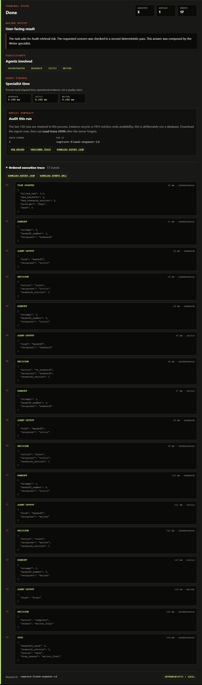

# Case study — policy before personality

**Multi-Agent Orchestration (P3)** coordinates deterministic Research, Critic, and Writer
specialists under typed handoffs, two hard budgets, explicit failure states, and an ordered
trace. The free path is intentionally simple: it demonstrates who may do what, how execution
stops, and what a caller can audit. It does not claim that three fake specialists produce a
better answer than one model.

*Deterministic fake specialists. Not a quality claim. The capture fixes the displayed request
ID so reruns are byte-comparable; runtime responses still receive unique request IDs.*

## Problem

Many “multi-agent” demos are an unbounded group chat. Role prompts describe responsibilities,
but nothing prevents a researcher from answering the user, a critic from retrying forever,
or a failed specialist from becoming an empty success. That makes the system hard to operate
and harder to trust: the interesting behavior exists only in prompt text and terminal logs.

P3 treats coordination as a small policy engine instead. Specialists exchange immutable
messages over an in-memory bus. The orchestrator validates each edge, owns counters and
terminal status, and appends JSON-safe events without copying the full task into the trace.
The result is reproducible for CI and inspectable in the browser console.

## Decision 1 — only Writer may produce a final answer

**Options considered:** allow any specialist to return text; let the orchestrator compose a
final answer; or reserve a discriminated `FinalAnswer` value for Writer.

Allowing any role to finish is flexible, but destroys provenance: research evidence, critic
feedback, and user-facing prose become indistinguishable. Letting the orchestrator write would
turn the policy layer into a hidden fourth specialist. P3 therefore makes `writer` the literal
author of `FinalAnswer` and validates that rule again at dispatch. Research and Critic can only
return handoffs. An impersonation attempt terminates `degraded`; an intermediate memo is never
promoted to final prose. See [ADR-0001](adr/0001-specialist-roles.md) and
[ADR-0002](adr/0002-writer-only-final.md).

## Decision 2 — handoff budget and retry budget are different controls

**Options considered:** one generic step counter; only a Critic retry limit; or independent
global handoff and Research-retry ceilings.

A retry ceiling prevents the obvious Critic–Research loop, but does not bound an unexpected
route elsewhere. A single generic counter bounds cost but cannot express the policy “Critic may
request at most two additional Research passes.” P3 keeps both: `max_handoffs` limits every
specialist dispatch, while `max_research_retries` limits that specific feedback loop to two.
The orchestrator owns both counters; no message can reset them. Whichever limit is reached
first produces `budget_exhausted` with the accounting and stop reason preserved in the trace.

This separation also makes review easier. A hiring manager can lower `max_handoffs` to one and
see a six-event budget stop, or run “Audit retrieval risk” and see one bounded re-research pass
inside a five-handoff, 17-event completion.

## Decision 3 — degraded is not an empty success

**Options considered:** let exceptions escape; catch failures and return an empty answer; or
return a typed degraded result that identifies the active boundary and stops the graph.

Crashing the whole HTTP request is explicit but discards orchestration accounting. Returning
an empty successful answer is worse: a caller cannot distinguish “no evidence” from “the
Critic never ran.” P3 catches specialist and policy failures at the orchestrator boundary,
records `specialist_error` plus a terminal decision, and returns `status="degraded"` with an
explanation. Writer is not invoked after an upstream failure, so availability never outranks
the Writer-only and review invariants. [ADR-0003](adr/0003-degraded-mode.md) records the trade-off.

## Decision 4 — optional P2 Research fails closed

**Options considered:** require P2 for every task; silently fall back to fake Research; copy
P2's loop into this repository; or put P2 behind an explicit HTTP capability.

The default factory always returns `FakeResearchAgent`, even if a URL happens to exist in the
environment. A caller must select `research="http"` and configure an absolute
`AGENTIC_RAG_URL`. Selecting HTTP without it returns a stable `409 capability_missing` with a
request ID; it is a client configuration error, not a server crash. Once configured, P3 makes
one bounded request to P2 and asks for P2's fake retriever by default. Timeout, transport,
non-success status, invalid JSON, or a missing report raises `AgentError`, which becomes a
degraded orchestration result without Writer.

P3 maps only P2's report and citation pointers into the existing Critic handoff. Its trace
stores a compact dependency pointer—not P2's raw task or nested trace. This preserves project
ownership (`P3 → P2`) and prevents a silent fake fallback from misrepresenting which evidence
path ran. See [ADR-0004](adr/0004-optional-p2-boundary.md).

## Evidence and limits

- `pytest` covers Writer ownership, retry and global budgets, specialist crashes, P2 success,
  HTTP error, timeout, missing capability, UI states, and capture integrity without sockets.
- Twelve golden tasks measure routing and accounting; two boundary cases prove fake selection
  and the HTTP-absent contract with `network_calls=0` and `billed_usd=0.0`.
- CI runs Ruff, strict mypy, pytest, and both eval slices with provider configuration empty.
- The UI capture script starts the real app on localhost and submits the same fake form a
  reviewer uses; it normalizes only the displayed request ID and records PNG SHA-256 values.
- Live P2 availability is opt-in. Remote-process isolation, hosted-model quality, and a claim
  that specialists outperform a single model remain outside v0.1.0.

## Interview version

I built P3 to show that multi-agent engineering is mostly policy, not extra personas. Research,
Critic, and Writer exchange typed messages, but the orchestrator alone owns routing and two
independent limits: a global handoff budget and a bounded Critic-to-Research retry budget. Only
Writer can construct the user-facing final value, and a crash becomes an auditable degraded
result instead of an empty success. Research can optionally call my P2 service, but that
boundary is explicit and fail-closed—missing configuration is a typed 409, dependency failures
stop before Writer, and the deterministic fake team remains the offline `$0` default. The UI
then exposes the actual ordered trace so those claims can be inspected rather than inferred
from a diagram.
