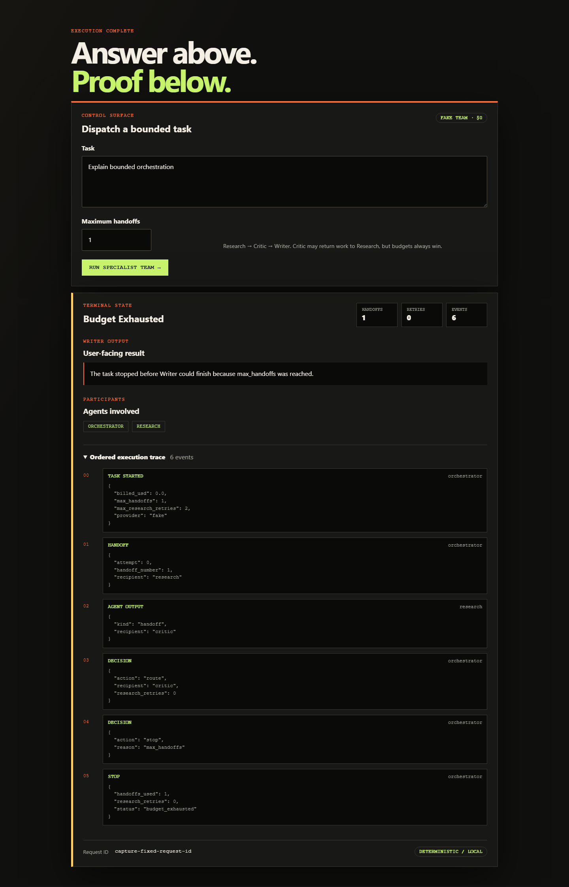

# Ship truth

**Status: P3 v0.1.0 LIVE.** The
repository can be cloned, tested, and run without a key. The fake team remains the default
for library, API, CLI, UI, and 12-task scorecard. An explicitly selected HTTP Research agent
can call P2 when `AGENTIC_RAG_URL` is configured and fails closed otherwise.

**Hosted free path LIVE:** <https://pax-orchestration.vercel.app>. It runs the deterministic
fake specialists and spends no model credits. Expect serverless cold starts; metrics and
retained runs are in-process only and disappear when the instance is recycled.

## Try the free path

Open <https://pax-orchestration.vercel.app> or reproduce it locally:

```bash
python -m venv .venv
python -m pip install -e ".[dev]"
python -m pytest -q
python -m uvicorn mao.main:app --port 8000
curl http://127.0.0.1:8000/health
curl http://127.0.0.1:8000/metrics
# browser console: http://127.0.0.1:8000/
```

## LIVE table

| Capability | State | Evidence |
| --- | --- | --- |
| Python package and FastAPI process | **LIVE** | package import and app startup |
| Public Vercel console/API | **LIVE** | [`pax-orchestration.vercel.app`](https://pax-orchestration.vercel.app); root adapter + production smoke |
| `GET /health` | **LIVE** | route and offline test |
| `POST /v1/tasks` and JSON CLI | **LIVE** | response-shape, OpenAPI, budget, and CLI tests |
| CI with OpenAI and P2 URL settings empty | **LIVE** | ruff, mypy, pytest, and evals workflow |
| Typed handoff protocol and fake specialists | **LIVE** | model and fake-agent tests |
| Orchestrator and global handoff/retry budgets | **LIVE (library)** | happy, retry, and exhaustion tests |
| Writer-only final enforcement | **LIVE** | type + policy violation test; ADR-0002 |
| Degraded specialist-failure outcomes | **LIVE** | crashing-Critic and impersonation tests; ADR-0003 |
| Ordered JSON-safe multi-agent timeline | **LIVE** | completeness, ordering, privacy, and budget-stop tests |
| 12-task golden evaluation | **LIVE** | three slices; [schema and limits](../data/eval/README.md) |
| HTTP-absent evaluation slice | **LIVE** | two configuration cases, zero network calls |
| Optional P2 integration | **LIVE (opt-in)** | mocked success/error/timeout tests; ADR-0004 |
| Accessible trace UI and request IDs | **LIVE** | GET, submit, terminal-state, and no-network tests |
| Prometheus text metrics | **LIVE** | content type, stable metric names, and post-task counter test |
| Timeline JSON download | **LIVE** | attachment header and exact in-memory event sequence test |
| Per-specialist elapsed timings | **LIVE (debug)** | injected-clock accounting test and result-page test |
| Generated UI captures | **LIVE** | Playwright script, pinned inputs, committed SHA-256 manifest |
| Non-root Docker + standalone Compose | **LIVE** | local build and container smoke |
| Tagged `v0.1.0` release | **LIVE** | public release targets the exact green release commit |

## Generated UI evidence

| Writer completes | Global budget stops |
| --- | --- |
| [](assets/ui-done.png) | [](assets/ui-budget.png) |

### Bounded Critic retry

[](assets/ui-trace.png)

*Deterministic fake specialists. Not a quality claim.* The script uses the real localhost app
and fake form path. It pins viewport, locale, task text, and budgets, disables motion, and
normalizes only the displayed request ID to `capture-fixed-request-id`; production request IDs
remain unique. It also normalizes displayed debug timings to `0.100 ms`; production timings
use a monotonic process clock. Two consecutive generation runs produced byte-identical PNGs recorded in
[`ui-captures.sha256`](assets/ui-captures.sha256).

```bash
python -m pip install -e ".[docs]"
playwright install chromium
python scripts/capture_ui.py
```

The live P2 smoke is still opt-in and is not involved in these captures. The hosted demo uses
the fake team and does not claim hosted-model quality.

## What CI proves today

- the package imports and its health route answers;
- deterministic specialists follow the allowed route;
- global handoff and Critic retry ceilings stop the loop;
- only Writer can complete successfully; and
- specialist/policy failures become explicit degraded results;
- API and CLI project the canonical result shape;
- traces are ordered, JSON-safe, and omit full task content;
- `/metrics` exposes process, request, terminal-status, and handoff signals without a backend;
- UI traces download as JSON attachments, and specialist timings remain debug-only;
- all 12 committed golden tasks meet their routing/accounting expectations;
- ruff, strict mypy, unit tests, and both eval slices run on Python 3.12; and
- the current free path does not need an OpenAI key.

It does not prove answer quality, remote-process isolation, live P2 availability, or
multi-model collaboration. HTTP tests prove the boundary contract, not quality uplift.

## Non-goals for v0.1.0

- No claim that several agents outperform one.
- No hosted model default, durable shared memory, or arbitrary tools.
- No remote-agent isolation, hosted quality score, or cost comparison.
- No silent promotion of target architecture to LIVE documentation.

## Release gate

The release was prepared only after the implementation gates completed. The tag targets the
exact release commit whose CI ran ruff, strict mypy, pytest, and both free-path eval slices.
Release notes separate LIVE capability from PLANNED claims.
