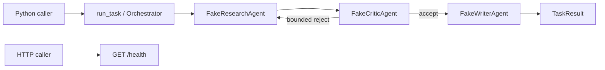
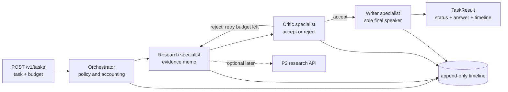

# Architecture — bounded specialist coordination

Status: **P3-M2 LIVE as a library; M3–M6 are target architecture.** Integrated `main`
contains immutable message/result models, deterministic Research/Critic/Writer specialists,
an in-memory bus, explicit transition policy, global handoff and Critic-retry budgets,
Writer-only final enforcement, and typed degraded/budget-exhausted results. FastAPI still
exposes only `GET /health`; there is no task route, timeline, evaluation set, or P2 client.

The system exists to answer one question: how can several specialists cooperate without
turning role prompts into an unbounded, unauditable conversation?

## Current runtime



The orchestration surface is Python-only. `GET /health` proves process availability and does
not invoke the team.

## Target transport and timeline



The current orchestrator is policy, not a fourth content author. It validates messages,
selects the next recipient, counts handoffs/retries, and decides the terminal status.
Specialists exchange typed values rather than shared mutable state. Recording each transition
and exposing the task over HTTP remain M3/later work.

## Roles and authority

| Participant | Owns | Must not do |
| --- | --- | --- |
| Orchestrator | Routing, budgets, terminal policy, timeline | Invent research evidence or final prose |
| Research | Evidence memo and evidence references | Address the user or approve its own work |
| Critic | Accept/reject decision and actionable concerns | Write the final answer or retry without a bound |
| Writer | Final user-facing answer from accepted evidence | Research new facts or bypass Critic |

The role boundary is recorded in [ADR-0001](adr/0001-specialist-roles.md). The
Writer-only output rule is separate because it is a security and provenance property, not
merely a division of labor ([ADR-0002](adr/0002-writer-only-final.md)).

## Handoff contract

The M1 contract is strict and immutable. Some fields needed for an external timeline remain
planned rather than being backfilled into a LIVE claim:

| Field | Purpose | State |
| --- | --- | --- |
| `kind` | Discriminates handoff from Writer final. | **LIVE** |
| `sender`, `recipient` | Closed-set identities; prevents accidental broadcast. | **LIVE** |
| `task` | Bounded root work unit carried across handoffs. | **LIVE** |
| `content` | Bounded memo for the addressed specialist. | **LIVE** |
| `attempt` | Research/critique retry number. | **LIVE** |
| `TaskBudget` | Global handoff and research-retry ceilings supplied to the run. | **LIVE** |
| `context_refs` | Evidence pointers rather than copied hidden state. | **PLANNED** |
| `correlation_id` | Joins future timeline/API records. | **PLANNED** |

Models reject unknown fields, and policy rejects invalid sender/recipient transitions. A remote
specialist must implement the same contract as the deterministic fake; transport choice must
not change policy.

## Budgets and termination

Two independent bounds make the target workflow finite:

1. `max_handoffs` is global and decremented before every specialist invocation.
2. Critic rejection may return to Research at most twice.

The state, not a prompt, enforces both limits. A handoff that would overspend becomes a typed
terminal outcome. A specialist cannot reset its own allowance by returning a new message.

```text
research -> critic -> writer                         success
research -> critic -> research -> critic -> writer  accepted retry
research -> critic -> research -> critic -> research -> critic -> stop
                                                            retry limit
any route whose next edge exceeds max_handoffs -> stop      global limit
```

## Writer-only final output

Only a value authored by Writer may inhabit the final-answer variant. Enforce this with a
discriminated union whose final author is the literal `writer`, then validate the same rule
at the orchestrator boundary. Research and Critic return handoffs, never strings that the API
could accidentally expose as final prose.

This gives one auditable place for answer formatting, evidence-reference validation, and any
future redaction policy. It does not make Writer a fact source: accepted evidence remains the
only input it may summarize.

## Isolation and degraded mode

A specialist failure is data for the orchestrator, not an empty memo. Today the isolation
boundary catches a specialist/policy exception and returns `TaskStatus.DEGRADED` with the
active specialist, exception type, and explanation. Tests cover a crashing Critic and a
Research specialist attempting to impersonate Writer.

The fuller evidence-preserving target is:

| Failure point | Safe result | Unsafe behavior |
| --- | --- | --- |
| Research fails before evidence | typed failure/refusal; no answer | Writer invents a substitute |
| Critic unavailable, evidence exists but is unapproved | `degraded` with no confident final, or a clearly labelled partial | silently treat missing review as acceptance |
| Writer fails after accepted evidence | `degraded` with evidence references and explanation, no fabricated prose | expose Critic memo as final answer |
| Optional P2 dependency unavailable | `degraded` only if a local evidence path produced usable evidence; otherwise typed dependency failure | silently claim P2 was used |
| Budget expires with partial evidence | `budget_exhausted` or `degraded`, preserving evidence and missing work | report success |

`degraded` means the workflow returned less than its intended contract and says exactly why.
It is not a synonym for exception suppression. The decision is recorded in
[ADR-0003](adr/0003-degraded-mode.md).

The current `TaskResult` does not yet expose partial evidence as a separate field; only its
explanation and accounting survive. Do not claim evidence-preserving partial output until that
contract and its tests land.

## Timeline contract

M3 will add an append-only timeline. Each record should include sequence number,
correlation id, sender, recipient, event type, remaining budget, outcome, and a safe content
digest or bounded summary. No secrets, raw environment variables, hidden prompts, or provider
credentials belong in it.

The minimum event set is `task_started`, `handoff_requested`, `specialist_completed`,
`specialist_failed`, `budget_changed`, `final_written`, `degraded`, and `task_stopped`.
Sequence numbers, not wall-clock timestamps, establish deterministic order on the free path.

## Evaluation boundary

M4 will introduce offline golden tasks only after the orchestrator exists. Required slices:

- accepted first-pass research;
- Critic rejection followed by bounded re-research;
- Writer-only final enforcement;
- global handoff exhaustion;
- Research, Critic, and Writer failure isolation; and
- deterministic timeline replay.

Fake specialists may prove routing, accounting, isolation, and trace contracts. They cannot
prove answer quality, specialist diversity, or model collaboration gains. Any future claim
that multiple agents outperform one agent needs paired tasks, named providers, cost/step
accounting, and uncertainty.

## Optional P2 boundary

P3-M5 may let Research call P2 through an explicit URL. That integration is optional and
must fail closed when requested but unavailable. P3 consumes P2's typed result and trace
references; it does not copy P2's planner or P1's retrieval stack. The default CI path remains
local and credential-free.

## Milestones

| Milestone | Capability | State |
| --- | --- | --- |
| M0 | Package, FastAPI process, `GET /health`, offline test, empty-key CI | **LIVE** |
| M1 | Typed protocol and deterministic Research/Critic/Writer specialists | **LIVE** |
| M2 | Orchestrator, transition policy, handoff/retry budgets, Writer-only final, degraded result | **LIVE as a library** |
| M3 | Deterministic multi-agent timeline | **PLANNED** |
| M4 | Offline golden tasks and behavioral scorecard | **PLANNED** |
| M5 | Optional P2 HTTP research boundary | **PLANNED** |
| M6 | Ship polish and v0.1.0 release | **PLANNED** |

The [SHIP page](SHIP.md) is the operational truth if code lands while this target design is
being implemented.
